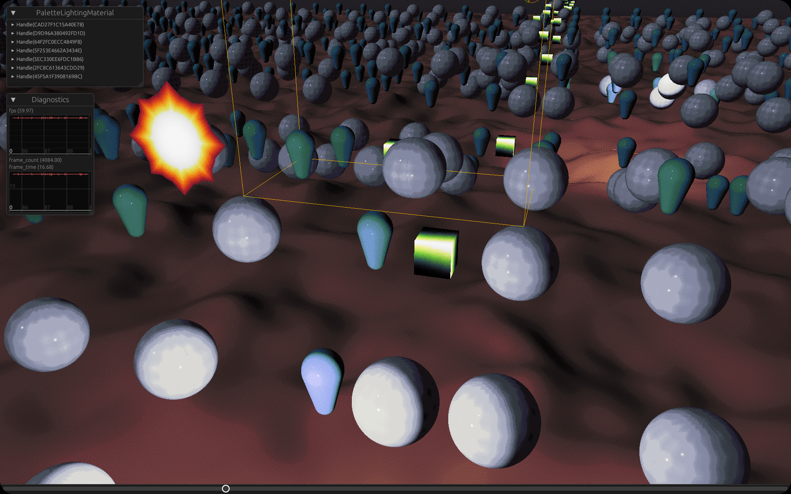

# Palette Lighting

A novel experimental renderer custom shader generation, raymarched signed distance fields, PBR lighting, and non-photorealistic palette dithering.

## Screenshots

Note: Due to pixel-perfect dithering, any resolution mismatch versus these screenshots (pinch-to-zoom on mobile, mouse wheel zoom on desktop, DPI scale) will result in the loss of intended visual effect.

### 1200p

### 4K

